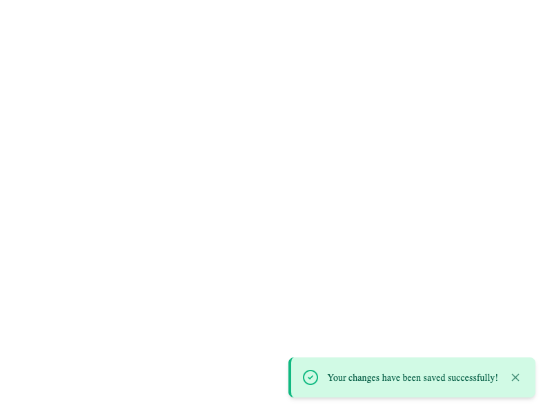
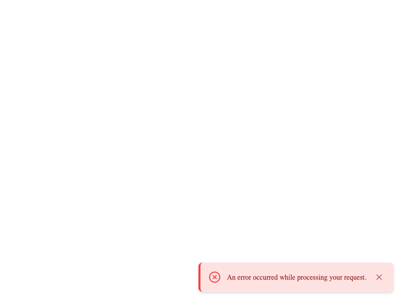
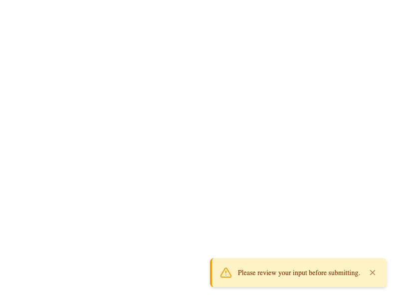
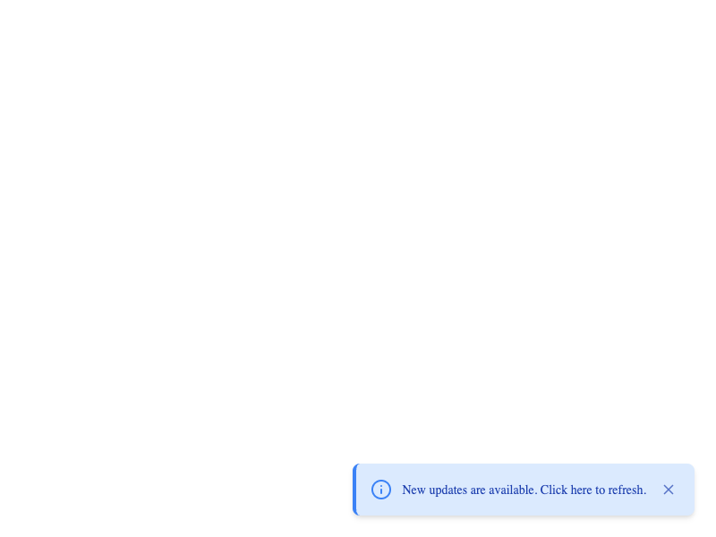
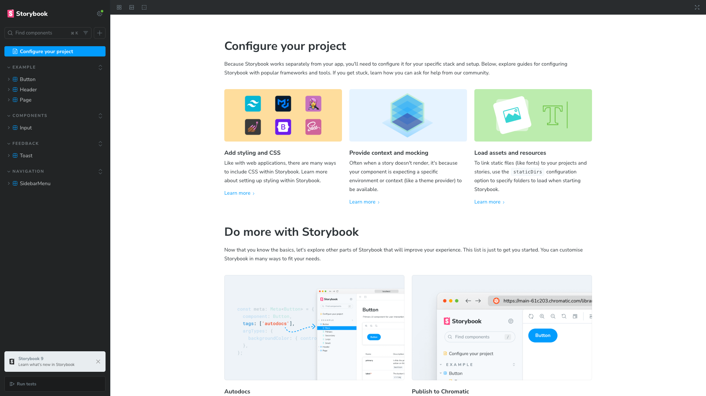

# React Components Library with Storybook

A library of reusable React components built with TypeScript and Storybook.

## 🚀 Quick Start

```bash
# Install dependencies
npm install

# Run Storybook
npm run storybook
```

Storybook will be available at: `http://localhost:6006`

## 📦 Components

### 1. Input

Smart input component with password visibility toggle and clear button.

**Features:**

- Multiple types: `text`, `password`, `number`, `email`
- Password visibility toggle with eye icon
- Optional clear button (`clearable` prop)
- Error and helper text support


---

### 2. Toast

Notification component with smooth animations.

**Features:**

- 4 types: `success`, `error`, `warning`, `info`
- Auto-close with configurable duration
- Slide-in/out animations from bottom right
- Manual close option






---

### 3. SidebarMenu

Sidebar menu with multi-level navigation.

**Features:**

- Unlimited nesting levels
- Smooth slide-in animation from right
- Accordion-style expandable submenus
- Backdrop click to close
- Custom icons support


---

## 📸 Storybook Interface



All components are fully documented in Storybook with interactive controls, multiple usage examples, and accessibility features.

